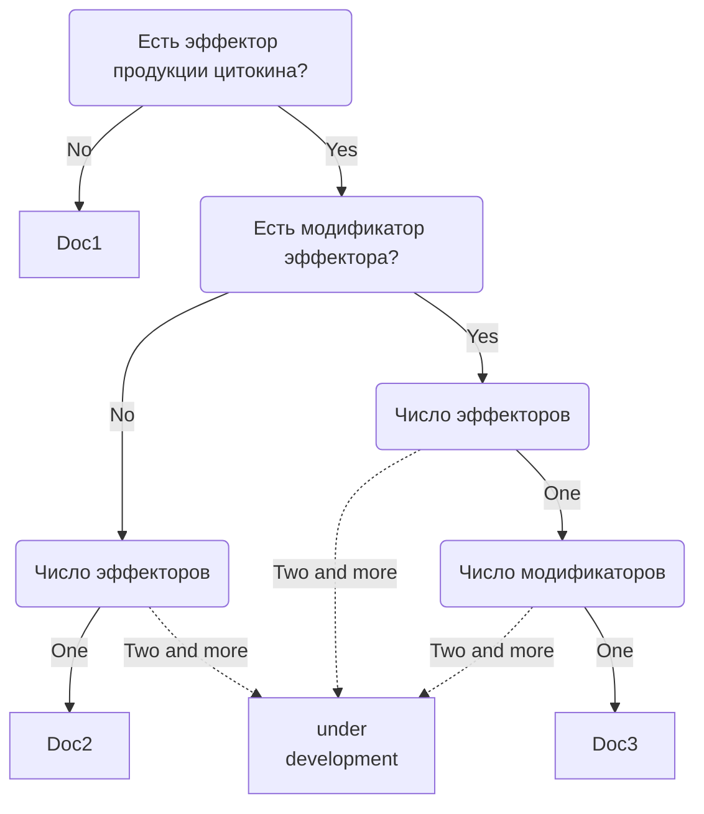

```mermaid
graph TD
    A(Есть эффектор продукции цитокина?)
    A -->|No| X[Doc1]
    A -->|Yes| B(Есть модификатор эффектора?)
    B -->|No| C(Число эффекторов)
    B -->|Yes| D(Число эффекторов)
    C -->|One| Y[Doc2]
    C -.->|Two and more| E[under<br>development]
    D -.->|Two and more| E[under<br>development]
    D -->|One| G(Число модификаторов)
    G -->|One| Z[Doc3]
    G -.->|Two and more| E[under<br>development]

```
<!--
click X "http://www.github.com" _blank
click X "./#section1"
click X "./cytokine/doc1.md"
-->