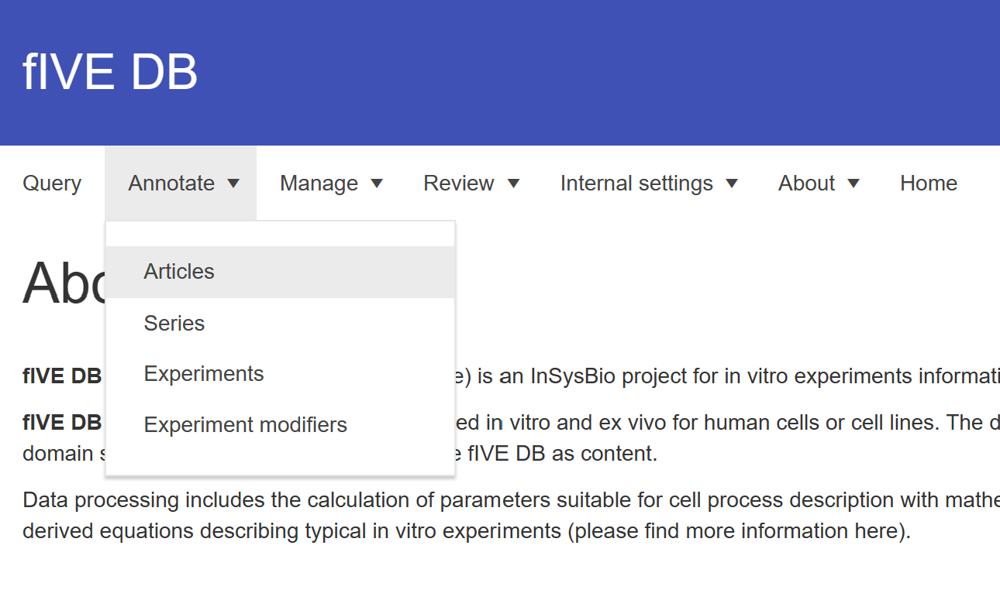
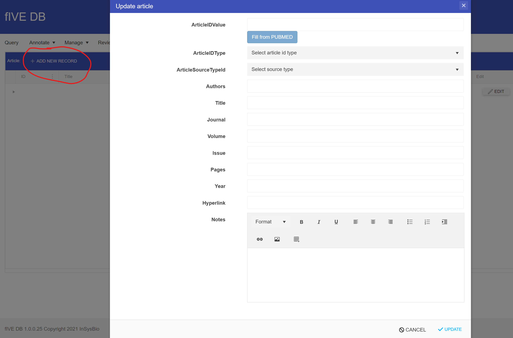

## Теория
<details> <!-- https://gist.github.com/pierrejoubert73/902cc94d79424356a8d20be2b382e1ab -->
    <summary style="">
        Click to expand!
    </summary>

### Derivation of equations
<!-- $$E=mc^2$$ -->
Обозначения:

$V$ - скорость продукции цитокина

$k_{base}$ - базовая константа продукции

$C_{cell}$ - концентрация клеток в среде

$Vol$ - объем среды

Вывод:

$ V=k_{base}*C_{cell}*Vol $

$ \frac{mole}{h} = \frac{mole}{cell*h} * \frac{cell}{L} * L $

$ k_{base} = \frac{V}{C_{cell}*Vol} = \frac{1}{C_{cell}} * \frac{\Delta A}{\Delta t * Vol} = \frac{1}{C_{cell}} * \frac{C_2 - C_1}{t_2 - t_1} $

#### Допущения

- Концентрация клеток постоянная (клеточная культура *in vitro* не растет за время измерения)
    
</details>

## Образцы данных, пригодных для внесения в базу

## Алгоритм

1. Для пользования базой необходимо в ней залогиниться по [ссылке](https://dev5db.insysbio.com/Account/Login). Если у Вас нет логина и пароля, пройдите [регистрацию](https://dev5db.insysbio.com/Account/Register).

2. Основное окно fIVE DB содержит несколько вкладок. Выберите вкладку **Annotate** и в выпадающем списке выберите **Articles**.

 <!--  -->

3. После нажатия на **ADD NEW RECORD** появится форма для ввода данных о статье.



4. Введите PMID статьи в поле **ArticleIDValure** и нажмите на **Fill from PUBMED**. Если не все поля заполняются автоматически из PubMed, то в пустых полях надо поставить “-”. После того, как все поля формы будут заполнены, нажмите **UPDATE** в правом нижнем углу формы. Если вы увилите сообщение <...> обратитесь к ревьюеру, который выдал вам статью.


##
 run
 ```
 MathJax.typeset()
 MathJax.typesetPromise()
 ```
