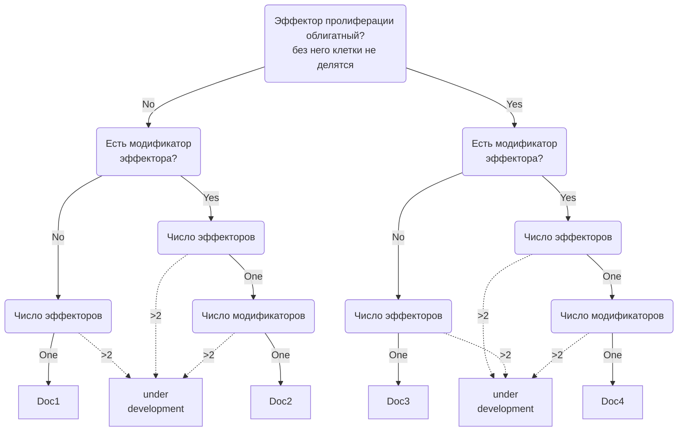

```mermaid
graph TD
    A(Эффектор пролиферации облигатный?<br>без него клетки не делятся)
    A -->|No| C(Есть модификатор<br>эффектора?)
    A -->|Yes| B(Есть модификатор<br>эффектора?)
    B -->|No| E(Число эффекторов)
    B -->|Yes| D(Число эффекторов)
    C -->|No| F(Число эффекторов)
    C -->|Yes| G(Число эффекторов)
    D -->|One| H(Число модификаторов)
    D -.->|>2| I[under<br>development]
    E -->|One| Y[Doc3]
    E -.->|>2| I[under<br>development]
    F -->|One| W[Doc1]
    F -.->|>2| J[under<br>development]
    G -->|One| K(Число модификаторов)
    G -.->|>2| J[under<br>development]
    H -->|One| Z[Doc4]
    H -.->|>2| I[under<br>development]
    K -->|One| X[Doc2]
    K -.->|>2| J[under<br>development]

```
