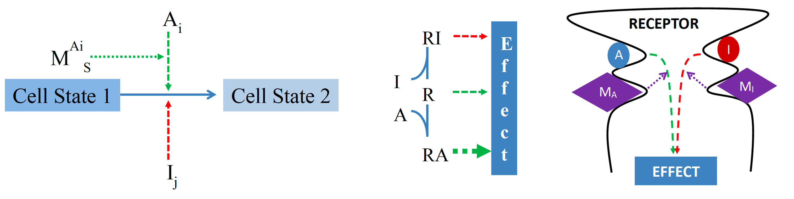

```{=html}
<style>
.logo_left {
 width: 18%;
 margin-right: 0in;
 //display: block;
 //height: 20%;
 margin-left: 0in;
 //padding: .3in 0 0;
 //float: right;
}
.logo_right {
 width: 10%;
}
</style>
```

```{r setup, include = F}
knitr::opts_chunk$set(echo = FALSE)
library(plotly)
library(dplyr)
```

# BACKGROUND

The QSP models are growing as well as the number of model parameters and resources needed to search for data for model calibration. To decrease uncertainty of the model most of the parameters are estimated without fitting and fixed at some values relevant to physiological state. `fIVE` (from In Vitro Experiment) database - is online tool (https://5db.insysbio.com/) aimed to facilitate calibration of biomodels based on <em>in vitro</em> data.

# METHODS

Curated fIVE DB hosts <em>in vitro</em> experimental datasets manually extracted from literature and translates them into kinetic parameters describing cellular processes like migration, proliferation, differentiation, etc. The framework built-in in fIVE DB is based on InSysBio uniform description of cell processes and their regulations [1]. For several standard <em>in vitro</em> cellular assays, the framework allows to estimate kinetic parameters ($k_{base}$, $E_{max}$, $EC_{50}$, etc.) using kinetic experimental results.
 <!-- 
(Fig. \@ref(fig:scheme))
-->

The framework is based on the following statements:<br>
1. A cell dynamics process is transition between different states of a cell.<br>
2. Control of each particular process is associated with a generalized receptor. Effector binds to receptor and effect is mediated by state of receptor. States of the receptor with bound activators/inhibitors promote faster/slower transition between cell states. Binding of an effector with receptor is assumed to be in equilibrium.<br>
3. There are two pairs of binding sites in the receptor: for activator and its modifier and for inhibitor and its modifier.<br>
4. Rate law of a process regulated by multiple effectors can be presented as:
$$ V = k(A,I,M) \cdot Cell_{state_1} $$
```{r scheme, echo = F, fig.align = 'center' , out.width = '80%', fig.cap = ''}

```

Сonsider one of the most common cases with one effector (e.g., activator $A$) and its modifier $M$. We can derive two equations corresponding to two cases when the activator is non-essential ($k_{base} \not = 0$) and essential ($k_{base} = 0$):

$$ k(A,M) = k_{base} \cdot
    \frac{
        1 +  E_{max}^A \cdot
        \frac{1 + E_M^A \cdot M/EC_{50}^M }
               { 1 + M/EC_{50}^M } \cdot 
        \frac{ A }{ EC_{50}^A } \mathbin{/}
        \frac{ 1 + EC_M^A \cdot M / EC_{50}^M }{ 1 + M / EC_{50}^M }
    }{ 1 + 
        \frac{ A }{ EC_{50}^A } \mathbin{/}
        \frac{ 1 + EC_M^A \cdot M / EC_{50}^M }{ 1 + M / EC_{50}^M }
    } $$

$$ k(A,M) = k_{max}^A \cdot
    \frac{
        1 + E_M^A \cdot \frac{M}{EC_{50}^M}
    }{
        1 + \frac{M}{EC_{50}^M}
    } \cdot
    \frac{
        \frac{A}{EC_{50}^A} \mathbin{/}
        \frac{1 + EC_M^A \cdot M / EC_{50}^M}
                {1 + M / EC_{50}^M}
    }{
        1 + \frac{A}{EC_{50}^A} \mathbin{/}
        \frac{1 + EC_M^A \cdot M / EC_{50}^M}
                {1 + M / EC_{50}^M}
    } $$
<!-- 
\begin{align*}
& k_{base} - \text{basal rate constant} \\
& k_{max}^A - basal rate constant
\end{align*}
-->
Parameters that can be estimated from <em>in vitro</em> data:

$k_{base}$ - basal rate constant <br>
$k_{max}^A$ - maximal rate constant <br>
$E_{max}^A$ - basal maximal effect of an activator without a modifier <br>
$E_M^A$ - maximal effect of a modifier on the effect of an activator <br>
$EC_{50}^A$ - activator's concentration corresponding to its half-maximal effect without a modifier <br>
$EC_{50}^M$ - modifier's concentration corresponding to its half-maximal effect on an activator's effect <br>
$EC_M^A$ - maximal modifier's concentration corresponding to its half-maximal effect on an activator's effect <br>

# RESULTS {.mybreak}

fIVE DB stores <em>in vitro</em> datasets, its experimental conditions and kinetic parameters calculated automatically if data available in a source is enough for making such estimates. An approach for translating <em>in vitro</em> and <em>ex vivo</em> experiments into kinetic constants is based on rate laws describing different cell dynamics processes and their regulation with multiple cytokines [2]. Besides, data collected in fIVE DB provides a good start point for model calibration. Immune Response Template (`IRT`) - InSysBio's QSP platform of the immune system for which developed approach was used to estimate the parameters as well as for the models of COVID, COPD, asthma, atopic dermatitis and in immunooncology. 

```{r irt, echo = F, fig.align = 'center' , out.width = '100%', fig.cap = ''}
font1 = list(size = 30)
font2 = list(size = 40)

# ann_covid = list(text = 'COVID', showarrow = F, font = font2)
# covid <- plot_ly(labels = c('fIVE DB<br>approach', 'fitted or<br>assumed'),
#         values = c(35, 65)) |>
#   add_pie(hole = .5, textinfo = 'none',
#           marker = list(colors = c('#7A2685', '#80C342'))) |>
#   layout(annotations = ann_covid, # margin = list(r = 150),
#          showlegend = F)
# 
# ann_irt = list(text = 'IRT', showarrow = F, font = font2)
# irt <- plot_ly(labels = c('fIVE DB<br>approach', 'fitted or<br>assumed'),
#         values = c(35, 65)) |>
#   add_pie(hole = .5, textinfo = 'none',
#           marker = list(colors = c('#7A2685', '#80C342'))) |>
#   layout(annotations = ann_irt, # margin = list(r = 150),
#          legend = list(x = .8, y = 1, font = font1))

ann = list(text = c('IRT', 'COVID'),
           x = c(.22, .81), y = c(.5, .5),
           showarrow = F, font = font2)
pie <- plot_ly(hole = .5, textinfo = 'none',
          marker = list(colors = c('#7A2685', '#80C342'))) |>
  add_pie(labels = c('fIVE DB<br>approach', 'fitted or<br>assumed'),
          values = c(35, 65), domain = list(row = 0, column = 0)) |>
  add_pie(labels = c('fIVE DB<br>approach', 'fitted or<br>assumed'),
          values = c(40, 60), domain = list(row = 0, column = 1)) |>
  layout(legend = list(x = .43, y = 1, font = font1),
         grid = list(rows = 1, columns = 2), annotations = ann,
         xaxis = list(showgrid = F, zeroline = F, showticklabels = F),
         yaxis = list(showgrid = F, zeroline = F, showticklabels = F))
pie
```


# DISCUSSION

The growing amount of experimental data and extracting kinetic parameters entails the appearance of services pursuing collection and storage of such a data. Curated database SABIO-RK [3] contains information about biochemical reactions and their corresponding kinetics embedded in their experimental context extracted manually from literature or directly submitted by experimenters. A repository BioModels Parameters [4] provides parameter values from models stored in BioModels Database [5]. The advantage of fIVE DB is the framework describing cell processes and routine automatic calculation parameters using derived formulas. Modelers and experimenters can compare parameters obtained from different sources and figure out the parameter range.

# CONCLUSION

fIVE DB team is building infrastructure to provide the systems modelling community with more convenient work environment and to make modelling routine less time-consuming and more productive. fIVE DB offer a complex solution including the framework and calculated parameters for equations. fIVE DB is being expanded to include new types of <em>in vitro</em> experiments, cells and molecules. In summary, fIVE DB is a repository to search quantitative data and parameters calculated in the framework of proposed description of cell processes that can accelerate the development of system biology models.

# REFERENCES

```{r QR, echo = F, fig.align = 'bottom', out.width = '48%', out.extra = 'style = "float:right; margin-left: .3in; padding: 0px"'}

```

1. Oleg Demin et al., ACoP7 (2016), W-021

2. https://insysbio.com/blog/

3. Ulrike Wittig et al. Nucleic Acids Research (2012), Volume 40 (Issue D1), Pages D790–D796.

4. Mihai Glont et al. Bioinformatics (2020), Volume 36 (Issue 17), Pages 4649–4654.

5. Rahuman S Malik-Sheriff et al. Nucleic Acids Research (2020), Volume 48 (Issue D1), Pages D407–D415. 

 <!-- 
[//]: #### Questions? Contact
[//]: [stepanov\@insysbio.com](mailto:stepanov@insysbio.com){.email} [//]: insysbio.com
-->
